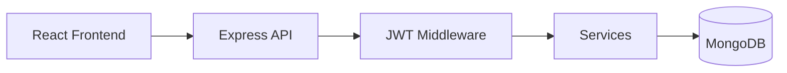

# CampusLedger — MERN Student Management System

Full-stack student management app built with **MongoDB, Express, React, and Node.js**.

Brand name: **CampusLedger**

---

## Features

- JWT authentication (register / login / logout)
- Role-based access: `admin`, `teacher`, `student`
- Student CRUD (search, filter, pagination)
- Course catalog CRUD
- Dashboard stats by department
- Seed data for instant demo
- Postman collection for API testing

## Frontend UI (Ant Design)

Uses **Ant Design 6** + icons so Form / Table / Modal code stays short and easy to teach.

```text
frontend/src/components/
  layout/AppShell.tsx             # sidebar shell
  auth/AuthShell.tsx              # login/register frame
  students/StudentFormModal.tsx   # add/edit student
  courses/CourseFormModal.tsx     # add/edit course
  courses/CourseCard.tsx
pages/                            # load data + open modals only
theme/campusTheme.ts              # CampusLedger brand tokens
```

---

## Architecture

```text
React (Vite + TypeScript)
        ↓  REST / JSON + JWT
Express API (TypeScript)
        ↓  Mongoose
MongoDB
```



---

## Project structure

```text
mern-student-management/
├── backend/          # Express + MongoDB API
├── frontend/         # React + Vite UI
├── postman/          # API collection
└── README.md
```

### Backend folders

| Folder | Responsibility |
|--------|----------------|
| `config/` | Env + DB connection |
| `models/` | Mongoose schemas |
| `routes/` | URL → controller mapping |
| `controllers/` | HTTP request/response |
| `services/` | Business logic |
| `middleware/` | Auth, validation, errors |
| `utils/` | Helpers + seed |

### Frontend folders

| Folder | Responsibility |
|--------|----------------|
| `pages/` | Route-level screens |
| `layouts/` | Shell / sidebar |
| `context/` | Auth state |
| `services/` | Axios API calls |
| `types/` | Shared TypeScript types |

---

## Prerequisites

- Node.js 18+
- MongoDB running locally (`mongodb://127.0.0.1:27017`)

---

## Setup

```bash
cd WorkSpace/mern-student-management

# Install root + both apps (first time)
npm install
npm run install:all
npm run seed

# Start backend + frontend together
npm run dev
# Backend  → http://localhost:5001
# Frontend → http://localhost:5173
```

---

## Demo accounts

| Role    | Email               | Password     |
|---------|---------------------|--------------|
| Admin   | `admin@sms.edu`     | `Admin@123`  |
| Teacher | `priya@sms.edu`     | `Teacher@123`|
| Student | `arjun@student.edu` | `Student@123`|

---

## API overview

| Method | Endpoint | Auth | Purpose |
|--------|----------|------|---------|
| POST | `/api/auth/register` | No | Register student |
| POST | `/api/auth/login` | No | Login, get JWT |
| GET | `/api/auth/me` | Yes | Current user |
| GET | `/api/students` | Admin/Teacher | List students |
| POST | `/api/students` | Admin/Teacher | Create student |
| GET | `/api/students/:id` | Yes | Get student |
| PUT | `/api/students/:id` | Admin/Teacher | Update student |
| DELETE | `/api/students/:id` | Admin | Delete student |
| GET | `/api/students/stats/dashboard` | Admin/Teacher | Stats |
| GET | `/api/courses` | Yes | List courses |
| POST | `/api/courses` | Admin/Teacher | Create course |
| PUT | `/api/courses/:id` | Admin/Teacher | Update course |
| DELETE | `/api/courses/:id` | Admin | Soft-delete course |

### Response format

```json
{
  "success": true,
  "message": "Students fetched successfully",
  "data": {}
}
```

---

## Database models

- **User** — auth identity (email, hashed password, role)
- **Student** — academic profile (roll, department, courses, GPA)
- **Course** — catalog item (code, credits, teacher)

Relationships:

```text
User 1──1 Student
Student *──* Course
Course *──1 User (teacher)
```

---

## Auth flow

1. User submits email/password
2. Backend verifies with bcrypt
3. JWT is returned
4. Frontend stores token in `localStorage`
5. Axios attaches `Authorization: Bearer <token>`
6. `protect` + `authorize` middleware gate routes

---

## Postman

Import `postman/CampusLedger.postman_collection.json`.

1. Run **Login** (saves token automatically)
2. Call Students / Courses endpoints

---

## CI/CD (GitHub Actions)

| Workflow | When | What it does |
|----------|------|----------------|
| `CI` | Push / PR to `main` | Builds backend + frontend |
| `Publish Full Stack` | Push to `main` | Publishes **both** apps |

### Public links (from GitHub Actions)

| App | URL |
|-----|-----|
| **Frontend** | https://vamsikrishna-1530.github.io/student-management/ |
| **Backend** | https://student-management-api-2hvd.onrender.com |

Frontend is hosted on **GitHub Pages**. Backend is published by Actions to **Render** (GitHub cannot host a Node API on `github.io`).

One-time backend connect + secret: see **[DEPLOY.md](./DEPLOY.md)**  
Deploy button: https://render.com/deploy?repo=https://github.com/vamsikrishna-1530/student-management

### Local Docker

```bash
docker compose up --build
# Frontend http://localhost:8080
# Backend  http://localhost:5001
```

---

## Why React does not talk to MongoDB directly

Database credentials and business rules must stay on the server. The browser only calls the REST API. That is how real products keep secrets safe and enforce authorization.
